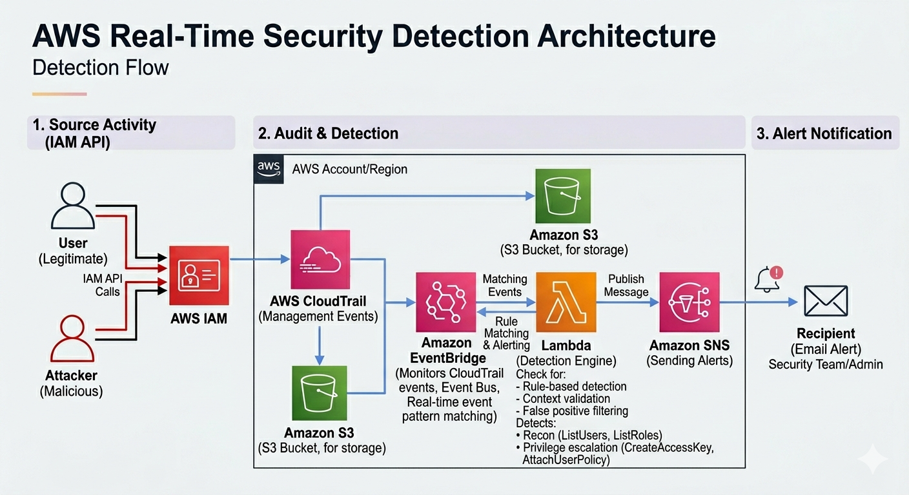
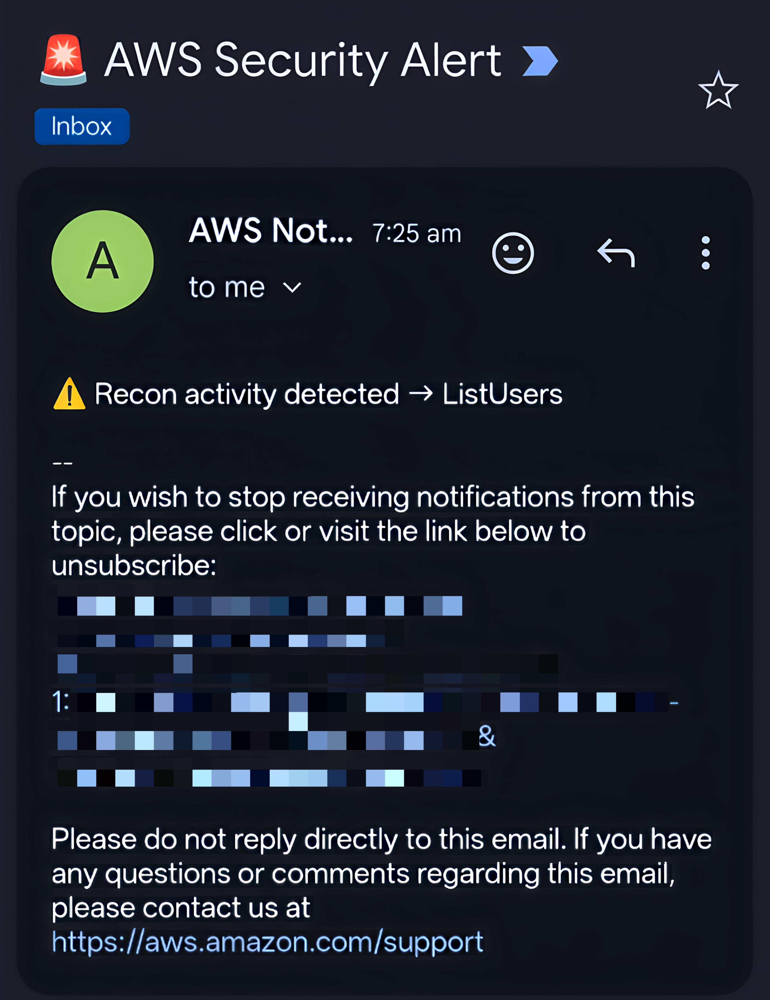

# 🚀 AWS Real-Time Cloud Security Detection System

## 📌 Overview
This project demonstrates a near real-time cloud security detection system built using AWS native services.

It detects suspicious IAM activity such as reconnaissance and privilege escalation attempts and sends alerts automatically using an event-driven architecture.

---

## 🏗️ Architecture

---

## 🔄 Detection Flow

User/Attacker → IAM API Call → CloudTrail → EventBridge → Lambda → SNS → Email Alert

---

## ⚙️ How It Works

### 1. AWS IAM
Users or attackers perform API actions such as:
- ListUsers
- CreateAccessKey

---

### 2. AWS CloudTrail
- Captures all API activity (Management Events)
- Stores logs in S3 for auditing
- Sends events to EventBridge for real-time processing

---

### 3. Amazon EventBridge
- Monitors CloudTrail events
- Uses event pattern matching to detect suspicious activity
- Triggers Lambda in near real-time

---

### 4. AWS Lambda (Detection Engine)
- Stateless serverless function
- Performs:
  - Rule-based detection
  - Context validation
  - False positive filtering

Detects:
- Recon activity → ListUsers, ListRoles
- Privilege escalation → CreateAccessKey, AttachUserPolicy

---

### 5. Amazon SNS
- Sends real-time alerts via email
- Notifies security team instantly

---

## 🚨 Example Alert

---

## 🔍 Detection Capabilities

- IAM reconnaissance detection
- Privilege escalation detection
- Real-time alerting system

---

## 🔐 Security Concepts Implemented

- Least privilege principle
- Event-driven security monitoring
- CloudTrail log analysis
- Serverless architecture

---

## ⚠️ Limitations

- Dependent on CloudTrail (if disabled, detection stops)
- Only monitors management events (no data event detection yet)
- Possible false positives if rules are not tightly scoped

---

## 🚀 Future Improvements

- Add data exfiltration detection (S3 GetObject monitoring)
- Implement auto-remediation using Lambda
- Multi-account centralized logging architecture
- Full Terraform automation

---

## 🧠 Key Learning

Built a real-world cloud security detection pipeline similar to production security monitoring systems.

---

## 👨‍💻 Author

Rakshit Bhat  
📧 rakshitb44@gmail.com  
🔗 LinkedIn: https://linkedin.com/in/rakshit-bhat
